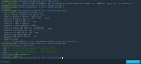
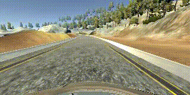
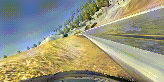

# CarND-Controls-PID
Self-Driving Car Engineer Nanodegree Program [](http://www.udacity.com/drive)

## Project Specification

### PID Controller

Project should met specification defined in [project rubric](https://review.udacity.com/#!/rubrics/1972/view)  

| Criteria | Result |
|----------|--------|
| Your code should compile. |  [](./img/01_build.png) |
| The PID procedure follows what was taught in the lessons. | Please follow **Solution description** section I |
| Describe the effect each of the P, I, D components had in your implementation. | Please follow **Solution description** section II |
| Describe how the final hyper-parameters were chosen. | Please follow **Solution description** section III |
| The vehicle must successfully drive a lap around the track. | [](./data/track_video.mp4) |

### Solution description.

#### I. How to PID controller implemented.

PID controller has been implemented according to description provided in lesson 12 step 11, and translated to C++.

   * [./src/PID.cpp](./src/PID.cpp) lines 13..21: ```Init``` method set coefficients values and reset error value.
   * [./src/PID.cpp](./src/PID.cpp) lines 23..28: ```UpdateError``` method set a proportional error and add integral error, differential error set first because proportional error value used from previous step.
   * [./src/PID.cpp](./src/PID.cpp) lines 30..34: ```TotalError``` method return a total error.

#### II. What is responsibility of P,I and D components.

During project implementation I've verified what is responsibility of each component:

#### P
   **P**roportional is responsible for eliminate _current_ error (_current_ deviation from central line of the road) value.

   

#### I
   **I**ntegral is responsible for sum (integral) error value over a time, it eliminate error by adding control effect due to _historic_ cumulative value of error.

   

#### D
   **D**ifferential is responsible for eliminate constant offset in error value, that can appear due to hardware configuration error.


   
### III. How hyper parameters were chosen.

 First of all I've tried to reuse hyper-parameters from lesson 12 step 11.

 

 These look nice only for initial part of track, this cause that I've implemented **twiddle** algorithm. It has been implemented according to lesson 12 step 13, translated to C++, and some changes has been made to use it with car simulator:

 * [./src/twidlle.h](./src/twidlle.h) lines 17..23: prepare modified set of parameters p+delta and p-delta.
 * [./src/twidlle.h](./src/twidlle.h) lines 31..54: process error collected during run with chosen parameters. If p+delta is better then best error save p+delta as current p, and increase delta, else if p-delta is better then best error save p-delta as current p, else leave current p unchanged and decremet delta.
 * [./src/twidlle.cpp](./src/twidlle.cpp) lines 44..80: twiddle main loop. It applied current parameters, collect data, and calls ```update_error``` and ```next_step```.

 Here provided sample output of [**twiddle**](./logs/twiddle.txt) algorithm:

 | Iteration | Branch  | Best error | p                         | delta p |
 |-----------|---------|------------|---------------------------|---------|
 | 0         |new best+|0.575438    |1,0,0                      |1.1,1,1|
 | 0         |new best-|0.561188    |1,0,-1                     |1.1,0.9,1.1|
 | 1         |new best+|0.0410819   |2.1,0,-1                   |1.21,0.9,1.1|
 | 4         |new best+|0.0230223   |3.0801,0,-1                |1.07811,0.6561,0.8019|
 | 6         |new best+|0.0220358   |4.0504,0,-1                |1.06733,0.531441,0.649539|
 | 7         |new best+|0.0140706   |4.0504,0.478297,-1         |0.960596,0.526127,0.584585|
 | 8         |new best-|0.00317681  |3.0898,0.478297,-1         |1.05666,0.526127,0.526127|
 | 8         |new best-|0.000220388 |3.0898,-0.0478297,-1       |1.05666,0.578739,0.526127|
 | 8         |new best-|0.000150545 |3.0898,-0.0478297,-1.52613 |1.05666,0.578739,0.578739|
 | 9         |new best-|4.54684e-05 |2.03315,-0.0478297,-1.52613|1.16232,0.578739,0.578739|
 | **20**        |new best-|**8.18158e-07** |1.62787,-0.0478297,-1.52613|0.445804,0.181615,0.181615|

 Best error on iteration **20** looks pretty nice, unfortunately parameters applied to simulation not look also nice:

 

 Also I've try to modified [**twiddle**](./logs/twiddle_r.txt) a bit. I've added some randomness in initial values of p. Output look like:

 | Iteration | Branch  | Best error | p                         | delta p |
 |-----------|---------|------------|---------------------------|---------|
 |0|new best-|0.179291|-0.0763474,0.849349,1.05708|1.1,1,1|
 |5|new best+|0.121734|-0.0763474,1.43984,1.05708|0.649539,0.649539,0.59049|
 |10|new best-|0.121263|-0.0763474,1.43984,0.708397|0.383546,0.383546,0.383546|
 |13|new best-|0.117184|-0.0763474,1.43984,0.397724|0.279605,0.279605,0.34174|
 |14|new best-|0.00812213|-0.355953,1.43984,0.397724|0.307566,0.279605,0.34174|
 |20|new best-|0.00653499|-0.537567,1.43984,0.397724|0.199776,0.148594,0.181615|
 |25|new best-|0.00169112|-0.537567,1.43984,0.290483|0.117966,0.0789688,0.117966|
 |163|new best-|0.00166709|-0.537567,1.43984,0.290483|5.71771e-08,3.82756e-08,6.98831e-08|
 |206|new best-|0.000182776|-0.537567,1.43984,0.290483|6.16098e-10,4.12429e-10,9.20344e-10|
 |**293**|new best+|**0.000105611**|-0.537567,1.43984,0.290483|7.86862e-14,4.78857e-14,1.06858e-13|

 It requests mach more iteration then 1st implementation, also best error not so good, as parameters applied to simulator.

 

  Unfortunately, **twiddle** algorithm require a lot of time, and not good reproducibility with same input. Probably it's better to use **twiddle** on a car mathematical model, but not on simulator. Also it looks like results affected by randomness introduced by simulator and limited numbers of samples that possible to collect on simulator.

 Last, I've tried to modify manually parameters, that are derived from lessons.
 * [./src/main.cpp](./src/main.cpp) lines 42..45: forward hyper-parameters.
 * [./src/forward.cpp](./src/forward.cpp) lines 59..72: forward implementation.

 I've manually reduce values of PID according to initial proportions. I've finished at Kp=0.1, Ki=0.0005, Kd=1.5. Some oscillation are observed on curve turns, but any way car can drive whole track at 40 MPH.

 

 I've reused throttle controller hyper-parameters from CarND-Behavioral-Cloning project.

#### Additional

  Binary usage:

  ```./pid``` - to run with final PID hyper-parameters.

  ```./pid twiddle```- to start twiddle tuning.

  ```./pid manual Kp Ki Kd``` - to start manually selected hyper-parameters and capture front camera images.


Project has been implemented by Yuriy Ivanov.
